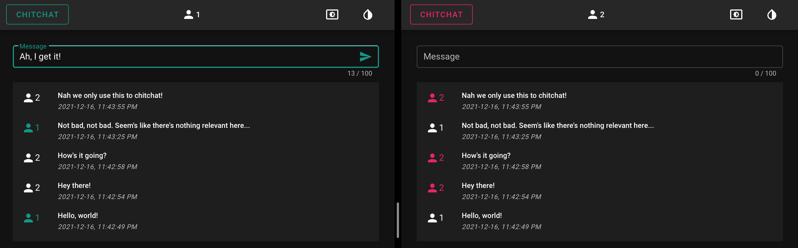

# ChitChat

A simple web app to engage in trivial matters, i.e. to chitchat.



This project is built with:
- [Vue 2][1] and [Vuetify][2] for the frontend
- [Rust][3] and [Axum][4] for the backend
- [Docker][5] for packaging

Note: I'd be thrilled to use [Vue 3][6] and [Tailwind CSS][7].
I had prior experience with Vuetify so I used here for quick prototyping.

[1]: https://vuejs.org/
[2]: https://vuetifyjs.com/en/
[3]: https://www.rust-lang.org/
[4]: https://github.com/tokio-rs/axum/
[5]: https://www.docker.com/
[6]: https://v3.vuejs.org/
[7]: https://tailwindcss.com/
[8]: https://tailwindui.com/

Top-level project structure:
- `/src`: contains the source code for the backend
- `/vue`: contains the source code for the frontend
- `/target` (.gitignored): contains the build artifacts for the backend when running `cargo build`
- `/static` (.gitignored): contains the build artifacts for the frontend when running `npm run build`
- `Dockerfile`: contains the instructions for packaging up the app
- `Makefile`: contains the aliases for frequently used commands

# Requirements

- Docker: https://docs.docker.com/get-docker/
- Node: https://github.com/Schniz/fnm/
- Rust: https://www.rust-lang.org/tools/install/

# How to build and run the app?

Note: if you don't have `make` installed, you can run the equivalent commands in `Makefile`.

1. Build the app as a docker image:
```
make build
```

2. Run the app as a docker container:
```
make run
```

3. Use the app on http://localhost:3000.

4. Stop the app and remove its docker container:
```
make stop
```

# How to test the app?

All tests must pass when building with docker as described above.
Otherwise, the build fails!

However, you can still quickly run all tests without building the full docker image:
```
cargo test
```

# How to format and lint the app?

1. Format and lint the backend code:
```
cargo fmt
cargo clippy
```

2. Format and lint the frontend code:
```
cd vue/
npm run lint
```

# How to build and run the app during development?

Note: if you don't have `cargo-watch` installed, you can install it with `cargo install cargo-watch`.

1. If you haven't done so, install the frontend dependencies:
```
cd vue/ && npm ci
```

2. Build the frontend static files in watch mode:
```
npm run dev
```

3. In a separate terminal, build and run the backend server in watch mode:
```
cargo watch -x run
```

# Next steps

- Authentication
- HTTPS
- Persistence
- CI pipeline
- Better logging
- Refactor tests
- Generate OpenAPI definitions
- Add more features (e.g. rooms, pagination or infinite scrolling, etc.)
