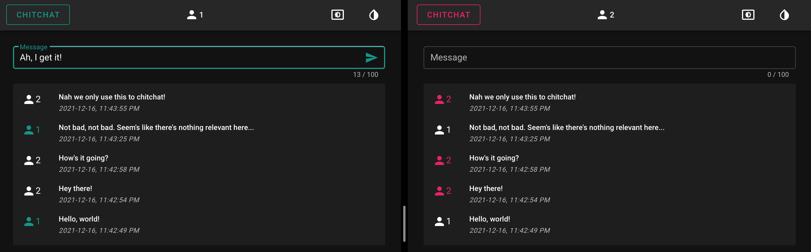

# ChitChat

A simple web app to engage in trivial matters, i.e. to chitchat.



This project is built with:

- [Vue][1] and [Vuetify][2] for the frontend
- [Rust][3] and [Axum][4] for the backend
- [PostgreSQL][5] for the database
- [Docker][6] for packaging

[1]: https://vuejs.org
[2]: https://vuetifyjs.com
[3]: https://www.rust-lang.org
[4]: https://github.com/tokio-rs/axum
[5]: https://www.postgresql.org
[6]: https://www.docker.com

# Requirements

- Docker (latest): https://docs.docker.com/get-docker/
- Node (16.13.1): https://github.com/Schniz/fnm/ or https://github.com/nvm-sh/nvm/
- Rust (1.57.0): https://www.rust-lang.org/tools/install/

However, this project is maintained such that you can build/run/test/format it with Docker only.

# How to build and run chitchat in "production" mode?

1. Build and run the default docker-compose file. Then, visit http://localhost:8080.
```
docker compose up --build
```

2. When you're done, stop the default docker-compose file.
```
docker compose down
```

# How to build and run chitchat in "development/watch" mode?

1. Build and run the "watch" docker-compose file. Then, visit http://localhost:8080.
```
docker compose -f docker-compose.watch.yaml up --build
```

2. When you're done, stop the "watch" docker-compose file.
```
docker compose -f docker-compose.watch.yaml down
```

# How to test chitchat?

1. Build and run the "test" docker-compose file.
```
docker compose -f docker-compose.test.yaml up --build
```

2. When you're done, stop the "test" docker-compose file.
```
docker compose -f docker-compose.test.yaml down
```

# How to format and lint chitchat?

1. Build and run the "lint" docker-compose file.
```
docker compose -f docker-compose.lint.yaml up --build
```

2. When you're done, stop the "lint" docker-compose file.
```
docker compose -f docker-compose.lint.yaml down
```
